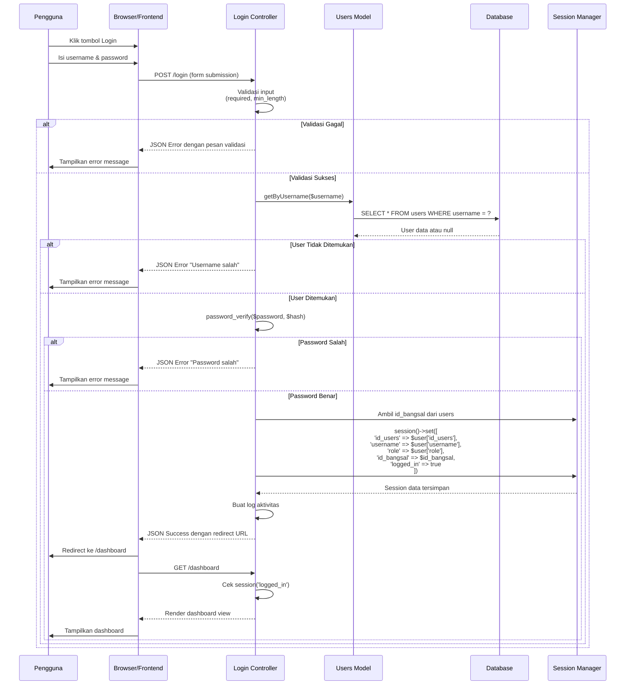
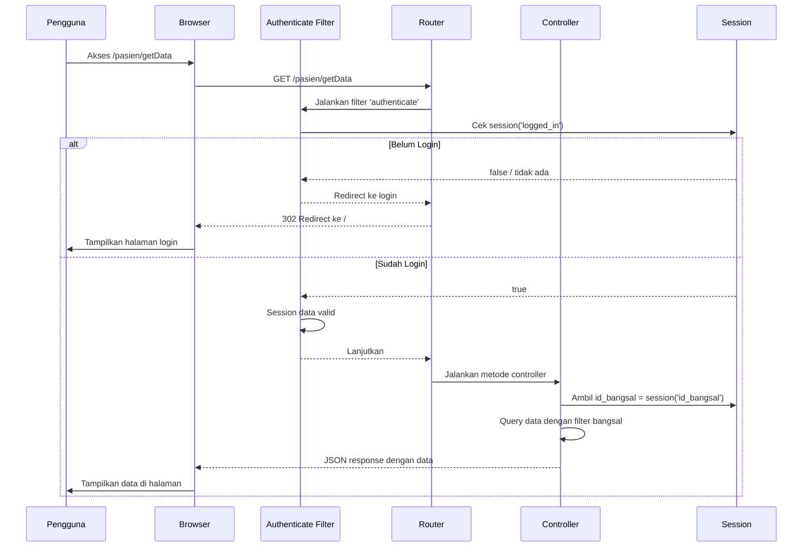
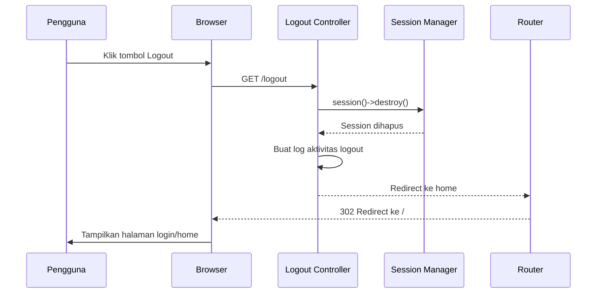
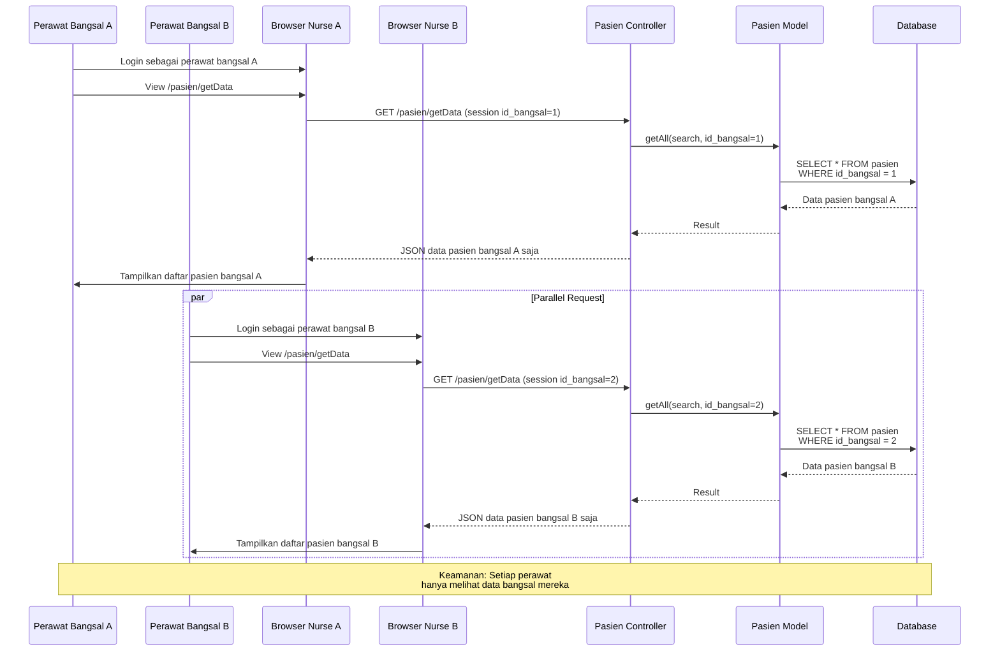
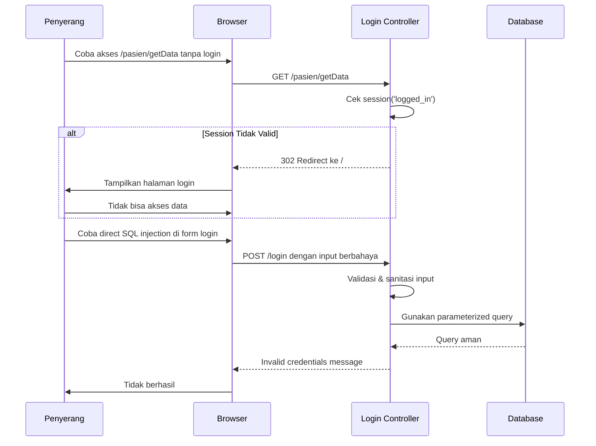

# SIM_DIET - Authentication Flow Diagram

## Sequence Diagram: Login Process

## Sequence Diagram: Protected Route Access

## Sequence Diagram: Logout Process

## Sequence Diagram: Ward-Based Access Control

## Sequence Diagram: Failed Authentication Security

## Catatan Keamanan (Security Notes)

### Key Security Points:
1. **Password Hashing**: `password_hash()` saat registrasi, `password_verify()` saat login
2. **Session Management**: Data sensitif disimpan di server session, bukan cookie
3. **Ward Isolation**: `id_bangsal` di session digunakan untuk filter semua query
4. **CSRF Protection**: CodeIgniter built-in CSRF token
5. **Input Validation**: Server-side validation di controller sebelum database query
6. **Prepared Statements**: Query builder CodeIgniter mencegah SQL injection

### Flow Identifikasi:
- ✅ Login → Password Verify → Session Set → Redirect
- ✅ Protected Route → Check Session → Filter by Ward
- ✅ Logout → Destroy Session → Redirect to Login
- ❌ No Session → Redirect to Login
- ❌ Wrong Password → Error Message (generic)
- ❌ Invalid User → Error Message (generic)
