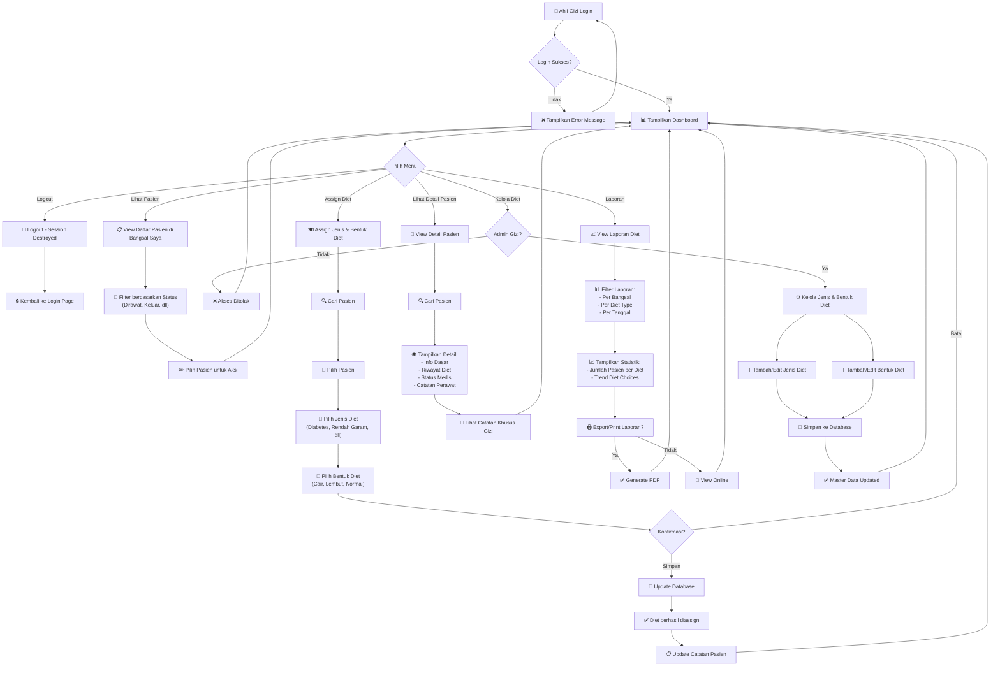
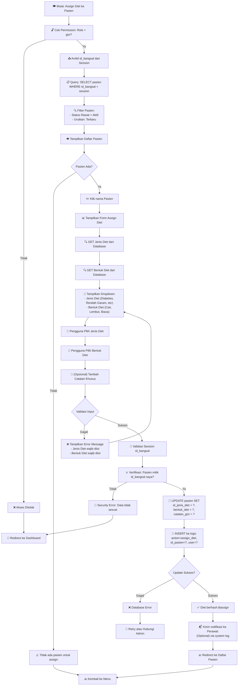
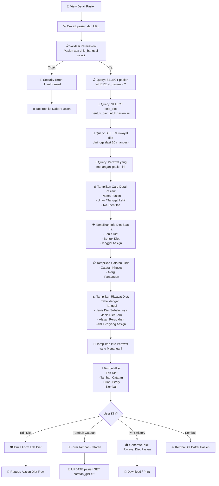
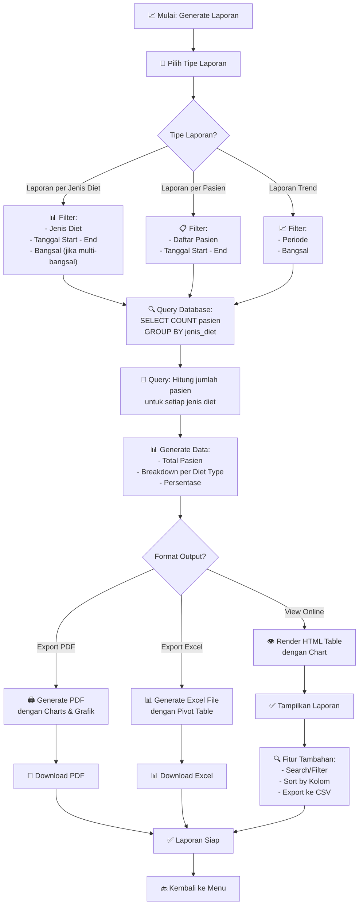
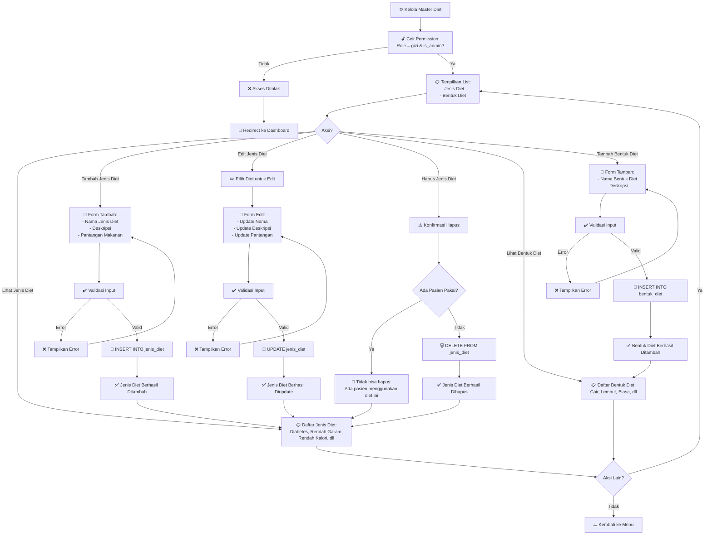
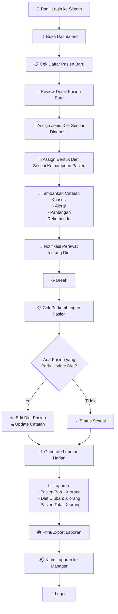

# SIM_DIET - Workflow Diagram untuk Ahli Gizi

## Flowchart: Main Workflow Ahli Gizi

## Flowchart: Assign Diet ke Pasien - Detail

## Flowchart: View Patient Details & Nutrition History

## Flowchart: Generate Laporan Diet

## Flowchart: Kelola Master Data (Jenis & Bentuk Diet)

## Activity Diagram: Daily Workflow Ahli Gizi

## Summary: Fitur & Akses Ahli Gizi

| Fitur | Akses | Keterangan |
|-------|-------|-----------|
| Login | ✅ Ya | Autentikasi berbasis username/password |
| View Dashboard | ✅ Ya | Ringkasan pasien dan diet |
| View Daftar Pasien | ✅ Ya | Hanya pasien di bangsal mereka (filter id_bangsal) |
| View Detail Pasien | ✅ Ya | Info lengkap + riwayat diet |
| Assign Jenis Diet | ✅ Ya | Pilih dari master data jenis diet |
| Assign Bentuk Diet | ✅ Ya | Pilih dari master data bentuk diet |
| Edit Diet Pasien | ✅ Ya | Update diet yang sudah diassign |
| Tambah Catatan | ✅ Ya | Catatan khusus untuk pasien |
| View Riwayat Diet | ✅ Ya | Lihat perubahan diet sebelumnya |
| Generate Laporan | ✅ Ya | Laporan diet per jenis/pasien/trend |
| Kelola Jenis Diet | ⚠️ Conditional | Hanya admin gizi |
| Kelola Bentuk Diet | ⚠️ Conditional | Hanya admin gizi |
| Kelola Perawat | ❌ Tidak | Admin/Manager saja |
| Kelola Bangsal | ❌ Tidak | Admin/Manager saja |
| Logout | ✅ Ya | Destroy session |
